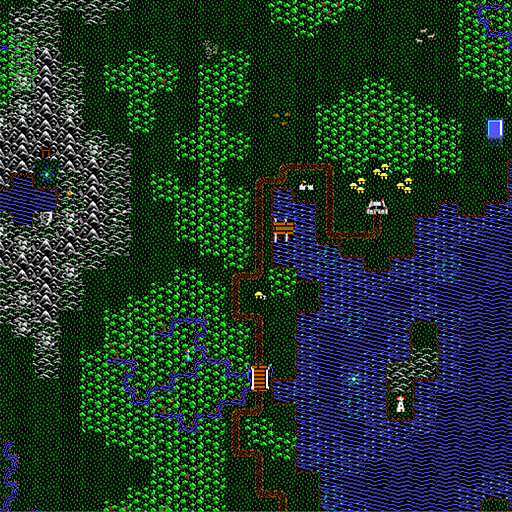

# UltimaV retroset

Tileset graphics mod for Ultima V series.

# Updates

Finally solved how to accomplish paths!

## Pre-new path preview

Primary mod use is theming the Ultima V overworld map [Britannia](https://github.com/hackedpassword/Nextgen-Maps#britannia-overworld). Map generation isn't recommended due to map-modding specificity.

## Features

- **Square tile** graphics (concealing the underlying hex grid)
- Movement remains 6-directional, mandatory being built on top of Unciv
- Original tiles and sprites
- Maximum preservation of orginal sprites
- 1:4 scale Britannia map (128^2) is still vast
- Terrain sprites gain more natural graphical transition
- Feature sprites (like forests) are layered for Unciv gameplay, looking completely original at game start
- Treasures hidden throughout the world, inclusive of expected reagents
- Exploration "feel" *closely* retained in a world of adventure

  
- Custom [Shadowlord realm themed borders](https://github.com/hackedpassword/Ethereal-borders) look like wild energy barriers (probably the coolest Unciv edge mod to date!)
- Towns, shrines, abbeys, moongates and dungeons
- Road Improvements for paths
- Carefully hand-placed resources across the land for an amazingly balanced game as civs scale, from start to end
- Meaningful economics and trading due to resource placement
- Layered sprites partially conceal items to be discovered
- Units re-themed
- Intense attention to crafting the map as accurately as possible factoring both hex->square and quarter-scale design challenges

## Not present, yet
- More re-themed units
- Re-themed nations to become pre-placed towns (ex. Paws or Moonglow, etc)
- Re-theming game entity names, see [Ultima V base](https://github.com/hackedpassword/UltimaV-base/blob/main/jsons/translations/English.properties)
- Re-themed icons
- Granting promotions that act like items or spells
- Better use of wonders
- Conversion into a true tileset vs modding over HexaRealm

## How do I get this because it sounds awesome!
1. Download Unciv
2. Within Unciv, in the Mods menu download `Ultima tileset` mod, `Ethereal borders` mod, and [Nextgen Maps](https://github.com/hackedpassword/Nextgen-Maps) mod
3. In the New Game screen choose "Custom map", look for Britannia, select
4. Make sure `Ultima tileset` and `Ethereal borders` are selected mods
5. Add some civs and nations, I think 12 civs and 20 nations should provide plenty of unrushed exploration and foundation

For a comparison, here's the original graphics:

I love this map! Credit to the author @drrak. The whole map is [here](https://drrak.github.io/ultima5/).

What should stand out the most is that you don't see hex tiles, only "square" tiles. This is an intended and tricky effect to mimic the original looks of the 1988 game.

There's a slight intermix of sprite tilesets, mostly PC version. I wanted to use the Apple ][e version but those sprites are far too low quality so I believe the PC version is my goto.

This mod could use a star :star: to show support of the unique retro concept!
