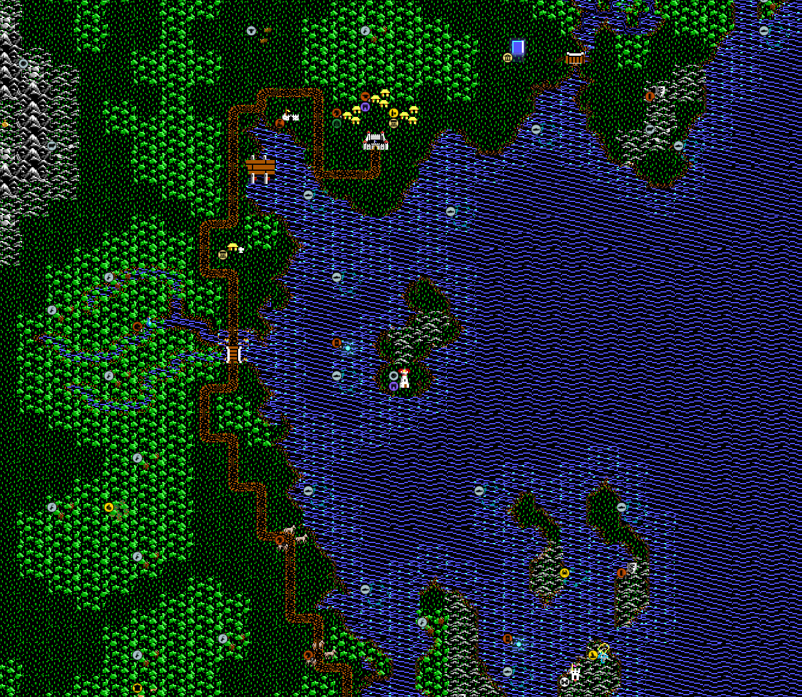

# Decorations as a terrain layer

Let's talk about how to add some _real customization_ to an Unciv map. We'll do this by creating some new `terrainFeature`'s that can be layered, then re-layering on top of the `ruleVariants` defined in `jsons/tileSets/[tileset].json`, the usual customizing of multi-layer tile sprites. We'll call this synthetic layer Decorations, or `terrainDecor`.

**Decors** give more control over rendering rules on terrain tiles by mixing in benign entities to terrainFeatures. Another mad modder creation ;)



The demo map above remains 100% playable with its familiar hex `terrain` tiles. Like in Ethereal Edges mod, there is an adjustment to perceived tile proximities that adds a more natural element to an otherwise defined set of tile adjacencies.

> "Wow, wow. That's f^k'n .. COOL. Whoa. LOL!!!" -me placing the first demo decorations

We'll discuss the components to successfully implement decorations, focusing on rivers. In this mod, there are currently 3 sets of decors: rivers, coast edges, and paths.

## Visualized!

A visual step-through should tell you most of what you want to know. I think this technique is probably easier with square-hex tiles due to less sides, but plenty of application to hex tiles. We'll focus on square-hex tiles atm. How-to follows.

| Swamp demo |  |
| ------- | ------- |
| image 1[](./decor-demo-1.md#decor_demo) | image 2 – [credit](https://drrak.github.io/ultima5/)[](./decor-demo-2.md#decor_demo) |
| image 3[](./decor-demo-3.md#decor_demo) | image 4[](./decor-demo-4.md#decor_demo) |
| image 5[](./decor-demo-5.md#decor_demo) | image 6[](./decor-demo-6.md#decor_demo) |
| image 7[](./decor-demo-7.md#decor_demo) | image 8[](./decor-demo-8.md#decor_demo) |

## Tech

Now, we will look closer at certain decor aspects of the swamp area as presented above in image 8.

🚨🤨 This document poses decors in an early form to bring awareness and familiarity by sharing the knowledge. On its own, anyone interested to try this theirselves will have enough information to implement decors.

### POI (1)

In the demo image, you'll find the rivers in this area missing - but they're not. River textures in `TileSets\HexaRealm\Tiles` are all blank and clear. Why? Decors will replace river textures, which cannot be re-ordered in rendering, causing overlay artifacts.

Rendering order artifacts lead to slop like this:

|  |  |
| ------- | ------- |
|  |  

Rivers render in an order that are uncontrollable, sometimes as dedsired, sometimes not. Rivers, specifically, are unaffected by the [fogOfWar](https://yairm210.github.io/Unciv/Modders/Creating-a-custom-tileset/#fogofwarcolor) tile visibility dimming effect. To compensate in Ultima V mod, creating thick rivers vs edge-line rivers, I darkened/muted the river color as to be a transitional color instead, enough to not be too distracting either when in or out of the fogOfWar. Not the intended artistic presentation. Decor layers aim to fix this.

Let's take a quick look at the sprite sheet rip, and the mod sprites involved:


Original terrain sprites are highlighted. We then have Grassland decors as 4-channel overlay sprites, river-decor, river-dev, and a regular Coast that's only used to be a terrain attribute modifier called Coast-edgeless, more on this soon.

### POI (2)

This swamp area is very interesting for its use of interconnecting river textures, where we can use land-specific corner decors instead of river-specific decors. 

Recall Ultima V mod scales Brittania 1:4, squares vs hexes, making river placement an interpretive artistic task. Perfect for demo'ing! Let's look at a GrasslandXX terrainDecor asset:

```
	{
		"name": "GrasslandSE",
		"type": "TerrainFeature",
		"unbuildable": true,
		"occursOn": ["Grassland","Plains","Desert"],
		"uniques": ["TerrainDecor","Grassland","Land",
		],
	},
```

Building a `terrainDecor` is actually quite simple. I'm still torn on caps `TerrainDecor` or `terrainDecor`, for our purposes either is fine but for json's the above is the current use. Now, how do we do it?

The way we lay down the decor, with all other layers, is first we must decide what order to present. Normally, a Forest then Jungle results in a different sprite than Jungle then Forest. With Grassland as the base, we could:
a. place the GrasslandXX water corner decor first, then Marsh, to represent marshy water in addition to marshy land.
b. place Marsh first, then decor, resulting in marshy land, normal water. Stacking other terrainFeatures like Forest and Jungle, or Hill, anything, all get the same treatment.

🧐 The decor math image further down makes this concept easier to understand.

Because the decor here has an opaque area and mostly alpha clear area, when it's applied over most any tile, the water edge appears and land portion appears to recess - automagic. Using these for rivers was actually accidental.

### POI (3)

You'll notice the swamp entrance has a much more natural appearance. Just a few decors did it. The result? _**Wow.**_ For fun, I threw in a couple extra water features that would usually have a river stub to affect movement and whatnot correctly. The overlay effect was too amazing to remove.

**Rivers are _invisible_ textures in-game!** Look again at POI (1), the rivers are there, but some mapper needs to place decor rivers. Well, how do handle map placement? We have a set of river-editor textures (the pink ones). These are specifically designed to be brightly edged, dim transparent core, to clearly see where we are placing rivers, and, clearly see that rivers _are_ placed. This is not a guessing game, we get it right. Decor rivers are placed, and we're certain they're right because the resulting blends look like what we're expecting.

Oh, forgot to add, as seen on the sprite map above, original river sprites are available as decors too. This requires some additional work in `Terrains.json`. I can add new river sets at will. This area has this type, that area has that type, maybe some special alternative mid-river, whatever, control over artistic variety is ours!

```
	{
		"name": "River-Bottom decor",
		"type": "TerrainFeature",
		"unbuildable": true,
		"occursOn": ["Land","Grassland","Mountain","Plains","Desert"],
		"uniques": ["TerrainDecor","River",
		],
	},
```

The `occursOn` array needs each terrain to be used on. For some reason 'Land' is not an acceptable wildcard. We add a label 'TerrainDecor' to be used later, and 'River' to take on river attributes - a special entity in Unciv that we must mind is treated differently than other entities.

### POI (4) and (5)

An interesting problem arose with edges. Applying the water corners at Coast edges doesn't draw over edges. This iirc was due to that hexes are drawn tile by tile in reading order. Whatever the reason the solution was creating a new terrain clone of Coast. There is no edge texture set for this terrain tile so edges are poof gone. As you see by the missing right edge, this needs more work, superficially simple just adding specific edge assets.

Coast-edgeless is applied as a replacement Coast in Terrains.json:
```
	{
		"name": "Coast edgeless",
		"type": "Water",
		"food": 1,
        	"gold": 1,
		"movementCost": 1,
		"RGB": [70, 138, 216],
		"uniques": ["Coast","[+2] to Fertility for Map Generation",
...
```

The only modification to Coast is adding the unique label 'Coast'. What this does is causes assets involved with Coast-edgeless to inherit Coast attributes. Through this inheritence, we don't have to update every single unique that has some connection to Coast. Easy!

## River map editing

Reference [image 4](https://raw.githubusercontent.com/hackedpassword/Unciv-Assets/refs/heads/main/Images/Ultima%20V/decor_demo/decor-demo_4.png) for context.

The pink rivers are editor guide images. We swap images before playing the real game.

### The business end

Here's the file structure for just the rivers - this structure is necessary in terms of good asset management.
```
## Tile images
mods/UltimaV tileset/Images/TileSets/HexaRealm/Tiles/
River-Bottom decor.png
River-Bottom.png
River-BottomLeft decor.png
River-BottomLeft.png
River-BottomRight decor.png
River-BottomRight.png

## Source for decor caulk
rivers/
River-all.psd

## Source of terrainDecor tile images, copied to ../..
Tiles/rivers/decor/
River-Bottom decor.png
River-BottomLeft decor.png
River-BottomRight decor.png

## Source caulk images copied to ../.. during map dev
Tiles/rivers/dev/
River-Bottom.png
River-BottomLeft.png
River-BottomRight.png
update_rivers.bat

## Source invisible images copied to ../.. for in-game River non-rendering
Tiles/rivers/game/
River-Bottom.png
River-BottomLeft.png
River-BottomRight.png
update_rivers.bat

## Basically same as /decor, felt it has a purpose, dunno atm
Tiles/rivers/legacy/
River-Bottom.png
River-BottomLeft.png
River-BottomRight.png
update_rivers.bat
```

update_rivers.bat:
```
copy /Y *.png ..\..
```

I can run update_rivers.bat from /dev, hit my shortcut that does an atlas regen, runs Unciv. When I want to see the in-game result, I do the same steps from /game. With keyboard shortcuts set up plus .bat file automation, moving between the two states are fast and painless.

## More decoration aspects

Resources are the next challenge, they're not as drop-in as I'd like. In `TileResources.json` we recreate 'Fish' and add:
```
	{
		"name": "Fish",
		"resourceType": "Bonus",
		"terrainsCanBeFoundOn": ["Coast","Coast edgeless"],
		"food": 1,
		"improvement": "Fishing Boats",
		"uniques": ["Generated on every [10] tiles <in [{Featureless} {Coast}] tiles>"]
	},
```

We see here the addendum to where Fish can be found, because inheritence doesn't work on that attribute. However, the unique references 'Coast', which should work for map gen. Map placement for Fish won't work on Coast-edgeless unless that update is applied to Fish.

🛠️ Still more work to do!

### Decor math

Here's a handy visual to see what decor can accomplish, the fine tuning possible, for any custom presentation desired. Don't forget, the resulting look of any combo here may appear bad, but in-game with other adjacencies, it could be just the combo needed!


## Conclusion

What's actually new here:
- Rendering River (each of the 3 directions) as invisible textures
- Using editor images for map dev and swapping working images
- Intentionally tiling no-effect terrainFeatures
- A new game aesthetic technique with immense potential

Decorations on their own are not new. It is a bit tedious to place decor layers meticulously. Overall, doable, amazing result.

Thanks for reading, if you wanted another visual effects ability, this technique should satisfy you and your fanbase! :D

@hackedpassword
